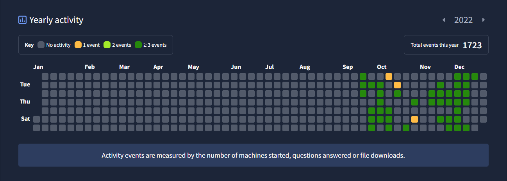
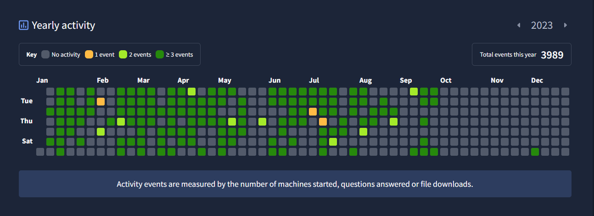
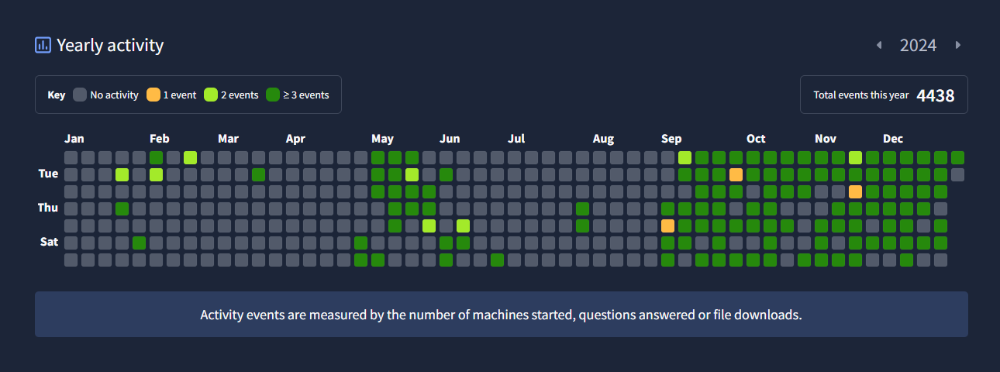
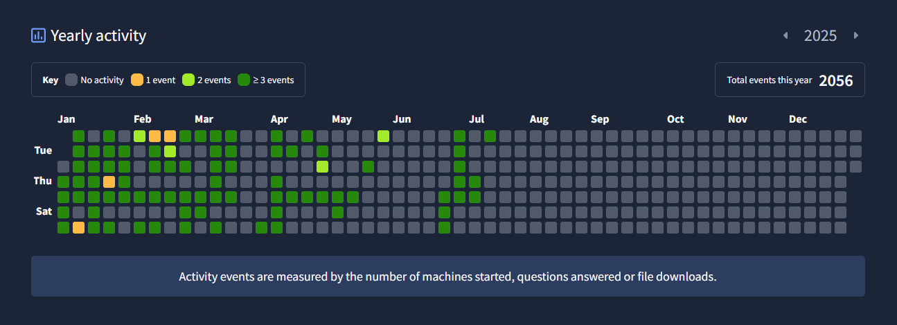

#  Consistency Tracker

This repository showcases my cybersecurity learning consistency on TryHackMe from 2022 to the present. Each calendar screenshot represents daily effort, hands-on exploration, and skill development across offensive and defensive security disciplines.

While there are gaps in some streaks, those periods weren’t idle — they were spent preparing for certifications, deep-diving into specific topics, and expanding my understanding of the field through rigorous study.

I believe that cybersecurity isn’t just about finishing labs — it’s about showing up consistently, evolving with new technologies, and staying curious. Whether I’m analyzing a vulnerability, decoding a packet, or studying for an exam, I'm always pushing forward!

(Although THM is not always credible, I am proud of my consistency with learning)

##  Progress Calendars

