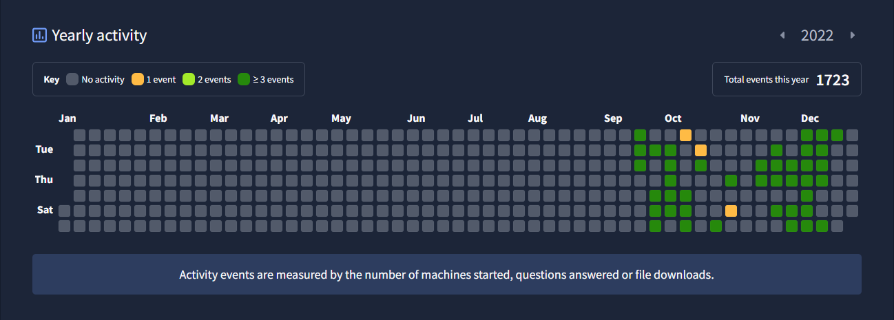
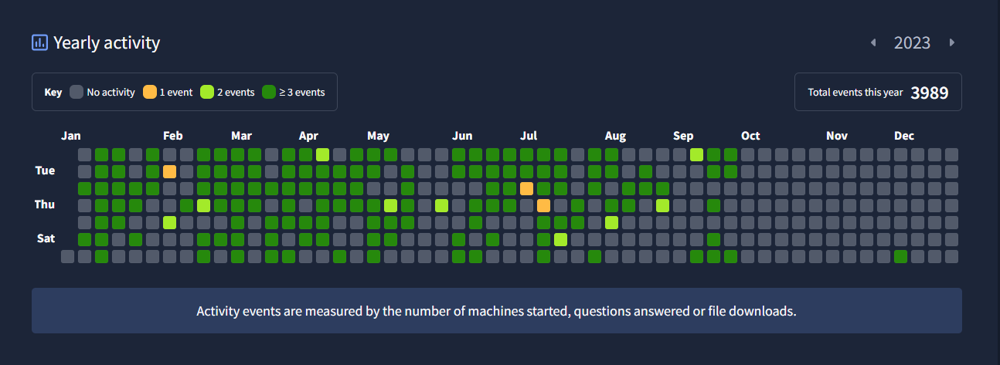
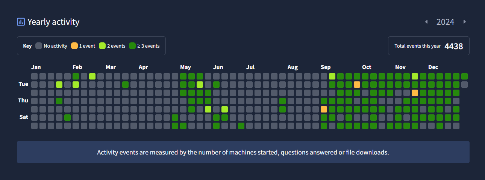
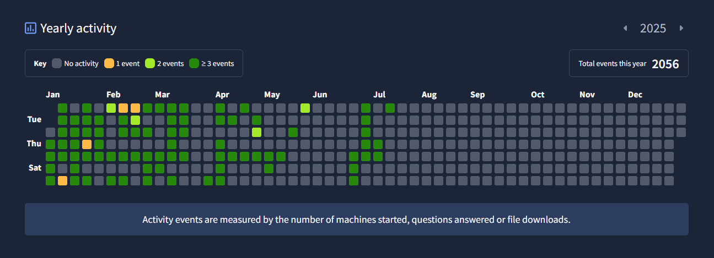

#  TryHackMe Consistency Tracker

This repository documents my cybersecurity learning streaks through TryHackMe from 2022 to present. Each calendar screenshot represents dedication to daily practice and skill growth in offensive and defensive security.

## 🖼 Progress Calendars

